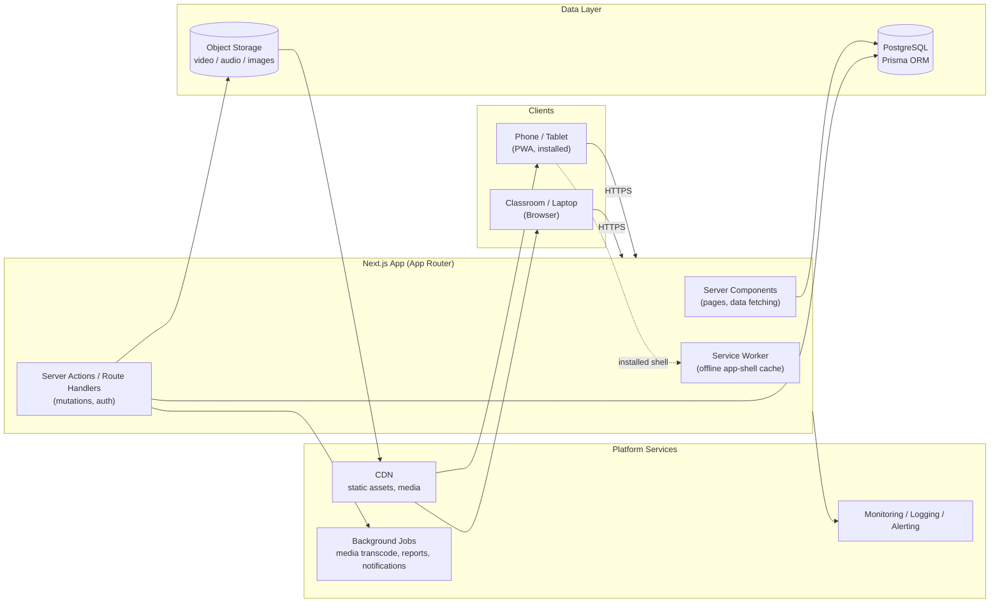

# 1. Product Architecture

## 1.1 Summary

Estudia RD is a server-authoritative Next.js web application, installable as a
Progressive Web App, backed by PostgreSQL. It serves five audiences — students,
parents/guardians, teachers, school administrators, and platform
administrators — from one codebase with role-based access control.

The guiding constraint from the product spec: **the server is always the
source of truth for student records.** The client (browser/PWA) may cache
lesson content and hold in-flight offline progress, but no student data lives
*only* in the browser.

## 1.2 High-level diagram



## 1.3 Why this stack

| Concern | Choice | Why |
|---|---|---|
| Application framework | Next.js 16 (App Router) + TypeScript | Server Components keep student data server-side by default; Server Actions give us auditable, typed mutations without a separate API layer; one deployable for web + PWA. |
| Database | PostgreSQL via Prisma ORM | Relational integrity for a deeply hierarchical curriculum model (Level → Cycle → Grade → Subject → Competency → Unit → Lesson → Activity); mature RBAC/row-level patterns; battle-tested for multi-tenant (multi-school) data isolation. |
| Auth/session | First-party signed, httpOnly JWT cookies (`jose`), not a third-party auth SDK | Two distinct session types are needed simultaneously — an **adult** session (email/password, MFA-capable) and a short-lived **student** session (PIN, no email) nested under it. This is unusual enough that a generic auth library adds more friction than it removes; a small, fully-audited session module is easier to reason about for a child-safety-sensitive product. Phase 2+ can swap in Auth.js/Clerk/Auth0 behind the same `lib/session.ts` interface if SSO or social login is required for staff accounts. |
| Styling | Tailwind CSS v4 | Fast iteration on the visual design system (§6); utility classes map directly to design tokens defined in `globals.css`. |
| Object storage / CDN | S3-compatible bucket + CDN (Phase 2) | Video/audio/images must not live in Postgres; adaptive streaming and low-bandwidth delivery require a CDN in front of object storage. Not yet wired up in the Phase 1 prototype — see §1.5. |
| Background jobs | Queue worker (Phase 2, e.g. a managed queue + worker dynos) | Media transcoding, PDF report generation, digest emails, and content-safety scans should not block request/response cycles. |
| PWA | Native `manifest.json` + a hand-written service worker | Caches the app shell (navigation, static assets) so the platform still loads offline; explicitly **never** caches `/api/*` or student-data routes, so the server stays authoritative. |

## 1.4 Application layers

```
src/
  app/                     Next.js routes (Server Components by default)
    (public)/              Welcome, register, login, accessibility
    profiles/               Child-profile selector, creation, PIN login
    student/                Student-only routes (guarded)
    parent/                 Parent-only routes (guarded)
    teacher/                Teacher/admin routes (guarded)
    admin/                  School/platform admin routes (guarded)
  actions/                 "use server" mutations, one file per domain
  components/              UI, incl. the interactive lesson-activity players
  lib/                     session, guards, prisma client, audit, a11y prefs
prisma/
  schema.prisma            Full data model (see docs/04-database-schema.md)
  seed.ts                  Demo school, users, curriculum tree, lessons
```

Route groups double as the authorization boundary: `student/layout.tsx`,
`parent/layout.tsx`, `teacher/layout.tsx`, and `admin/layout.tsx` each call a
`requireAdult(roles)` or `requireStudent()` guard (`src/lib/guards.ts`) before
rendering *any* child route — there is no route under those groups that skips
the check.

## 1.5 Two-tier session model

A device is often shared by a whole family. The platform therefore layers two
sessions:

1. **Adult session** (`sg_session` cookie) — created at `/login` or
   `/register`. Represents a `User` (`PARENT` / `TEACHER` / `SCHOOL_ADMIN` /
   `PLATFORM_ADMIN`). 14-day expiry.
2. **Student session** (`sg_student` cookie) — created only *after* an adult
   session exists, by selecting a child at `/profiles` and entering that
   child's PIN. Represents a `StudentProfile`, never a `User`. 8-hour expiry
   (kiosk-friendly: a classroom device naturally re-prompts for a PIN each
   session).

Logging the adult out (`logoutAdult`) always clears both cookies. Exiting
student mode (`exitStudentMode`) clears only the student cookie and returns to
the profile selector — the adult stays signed in, matching the real-world
flow of a parent handing a device to one child after another.

Kiosk mode (a school-owned tablet where a class code + student PIN grid
replaces the adult-login step entirely) is scoped for Phase 2 — see
`docs/07-implementation-roadmap.md`.

## 1.6 Progress & resume — the core technical guarantee

`ProgressCheckpoint` is one row per `(studentProfileId, lessonId)`
(`prisma/schema.prisma`). Every activity transition calls
`saveCheckpoint()` (`src/actions/progress.ts`), which **upserts** that row
with the exact activity id and a `positionStep` (and, for audio/video,
`positionSeconds`). The lesson player reads this row before rendering
(`src/app/student/lesson/[lessonId]/page.tsx`) and starts the player at
`initialStep`, never at activity 0. This is what "Continue Learning" and
in-lesson resume are both built on — there is exactly one code path for
"where did this student leave off," used by both the dashboard and the
player itself.

Completion (`ProgressCheckpoint.completed`) and mastery
(`SkillMastery`, keyed by competency) are deliberately separate models —
finishing an activity does not, by itself, imply the underlying competency is
mastered; mastery is only touched when a *scored* activity attempt
(`Attempt`) crosses a threshold (`src/actions/progress.ts`,
`recordAttempt`).

## 1.7 Offline & low-bandwidth strategy (Phase 1 scope, Phase 2 target)

Implemented now:
- No external font fetch (system font stack) and no third-party analytics/ad
  scripts — nothing blocks first paint on a slow connection.
- Read-aloud everywhere (letters, words, sentences, stories) uses the
  browser's built-in `speechSynthesis` API instead of streamed audio files —
  zero bytes over the network per narration.
- A service worker (`public/sw.js`) caches the navigational app shell so the
  platform still opens offline; it explicitly bypasses `/api/*` so cached
  responses can never masquerade as current student data.

Phase 2 (see roadmap): background sync of downloaded lesson bundles
(content + pre-generated audio) to IndexedDB, with a conflict-resolution
policy for offline attempts made before reconnecting (last-write-wins per
checkpoint, all attempts always kept — attempts are additive/append-only by
design, so nothing is lost even under conflicting concurrent writes).

## 1.8 Multi-tenancy (school data isolation)

Every school-scoped row carries a `schoolId` (or transitively derives one
through `classroom.schoolId`, `studentProfile.schoolId`, etc.). Every
`requireAdult()` in a teacher/admin/school route additionally filters queries
by `session.schoolId`, so a `SCHOOL_ADMIN` at School A can never enumerate or
mutate School B's classrooms, students, or curriculum configuration.
`PLATFORM_ADMIN` is the only role without that filter (see
`docs/03-roles-permissions-matrix.md`).

## 1.9 Auditability

`AuditLog` (append-only) is written on every security- or privacy-relevant
action — login, registration, profile creation, student-session start,
content status changes, Bible Studies configuration changes, feedback sent,
assignments reopened (`src/lib/audit.ts`, called from every action file).
This is the backbone of the school admin's "audit logs" requirement (spec
§11) and of incident response (spec §15).

## 1.10 Mobile-readiness

The API surface is Server Actions today (Phase 1), which are Next.js-specific
and not directly callable from a native mobile app. Because all business
logic lives in `src/actions/*.ts` as small, single-purpose functions that
only talk to Prisma, promoting them to a versioned REST/GraphQL API in
front of the same Prisma schema (Phase 2, when a native app is scoped) is a
mechanical refactor, not a redesign — the data model and authorization rules
do not change.
