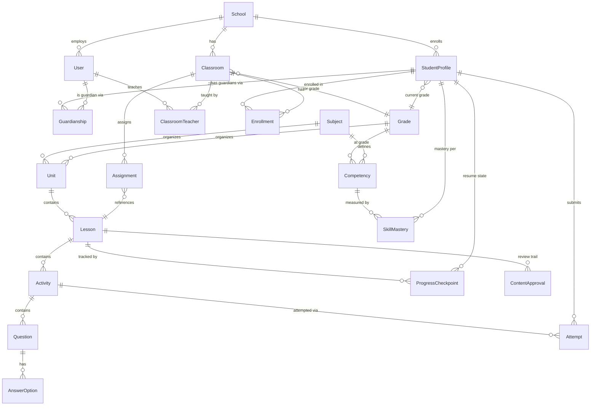

# 4. Database Schema

The canonical schema is `prisma/schema.prisma` — this document is an
annotated map of it, not a duplicate. Run `npx prisma studio` against the
seeded local database for a live, browsable view.

## 4.1 Entity groups

The ~45 models fall into eight groups:

1. **Identity & access** — `User`, `StudentProfile`, `Household`,
   `Guardianship`
2. **Schools** — `School`, `AcademicYear`, `Term`
3. **Curriculum structure** — `Cycle`, `Grade`, `Subject`,
   `SchoolSubjectConfig`, `Competency`, `AchievementIndicator`, `Unit`,
   `Lesson`, `LessonCompetency`, `LessonIndicator`, `ContentApproval`,
   `Activity`, `MediaAsset`, `Question`, `AnswerOption`
4. **Classrooms & assignments** — `Classroom`, `ClassroomTeacher`,
   `Enrollment`, `Assignment`, `AssignmentStudentOverride`
5. **Progress & mastery** — `ProgressCheckpoint`, `Attempt`, `SkillMastery`,
   `ReadingRecording`, `TeacherFeedback`
6. **Motivation** — `Achievement`, `StudentAchievement`
7. **Personalization** — `DiagnosticAssessment`, `DiagnosticResult`
8. **Trust & operations** — `Notification`, `ConsentRecord`, `AuditLog`

## 4.2 Core ER diagram (simplified)

## 4.3 Design decisions worth calling out

- **`ProgressCheckpoint` is unique per `(studentProfileId, lessonId)`.** This
  is the single row that answers "where did this student leave off" — see
  `docs/01-architecture.md` §1.6. It is intentionally *not* one row per
  activity: a lesson resumes at one place, not many.
- **`Attempt` is append-only, never updated in place.** A student can retry an
  activity without penalty (spec §4) because every attempt is a new row;
  nothing is overwritten, so a teacher can see the full history, not just the
  latest try.
- **Completion vs. mastery are different models on purpose**
  (`ProgressCheckpoint.completed` vs. `SkillMastery.level`), per spec §6.
- **`AssignmentStudentOverride` lets a teacher reopen/extend/exclude a single
  student's assignment without touching the `Assignment` row itself or
  deleting any `Attempt` history** (spec §6, §10).
- **`Activity.content` is JSON**, typed at the application boundary
  (`src/lib/activity-types.ts`) rather than the database boundary. New
  interaction types (spec lists a dozen+ activity formats) can be added
  without a migration for every one; `Question`/`AnswerOption` stay
  relational because quizzes need queryable, gradeable structure.
- **`Grade.isCustom` + `Grade.schoolId`** let a school add a legacy/custom
  grade label without touching the shared MINERD-aligned grade set (spec
  §2).
- **`Subject.isFaithBased` + `SchoolSubjectConfig`** implement Bible Studies
  as a subject any school can enable/disable independently of the official
  MINERD Formación Humana y Religiosa curriculum (spec §3).
- **`AuditLog` is append-only and schema-flexible (`metadata: Json`)** so new
  audited actions never require a migration.
- **Every school-scoped model carries (directly or transitively) a
  `schoolId`**, which is what makes tenant isolation a WHERE clause instead
  of a separate database per school (see §3.3 in the roles doc).

## 4.4 Indexes

Indexes are placed on the columns every guarded query actually filters by:
`schoolId` on `User`/`StudentProfile`, `(studentProfileId, lastAccessedAt)`
on `ProgressCheckpoint` (powers "Continue Learning" — most-recent,
not-completed), `(studentProfileId, activityId)` on `Attempt`,
`(schoolId, createdAt)` and `(entityType, entityId)` on `AuditLog`. As usage
data comes in, add composite indexes for the specific teacher/parent report
queries that turn out to be hot.
