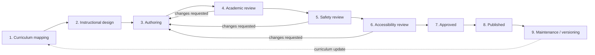

# 9. Content Production Plan

How the full MINERD-aligned curriculum gets created, reviewed, approved, and
maintained — not just described. This plan is what
`docs/07-implementation-roadmap.md` Phase 2/3 execute against.

## 9.1 Honesty constraint (spec §13, §20)

**The platform must never claim the complete Dominican curriculum is
available if it hasn't been reviewed and approved.** Concretely, this means:

- The app only ever displays `Lesson.status = PUBLISHED` content to
  students (`src/app/student/page.tsx`, `student/lesson/[lessonId]/page.tsx`
  — both filter on `status: "PUBLISHED"`).
- Nothing in the UI implies subject/grade coverage that doesn't exist yet —
  the student library shows exactly the published lessons that exist for a
  student's grade, with no "coming soon" grid implying a false completeness.
- The five Phase 1 demo lessons are explicitly labeled in their own
  `sourceAttribution` field as "Estudia RD — contenido de demostración, Fase
  1," not attributed to MINERD, because they are illustrative content
  authored for this prototype, not sourced/reviewed MINERD curriculum.

## 9.2 Content pipeline (per lesson)

This maps directly onto `ContentStatus` in the schema
(`DRAFT → ACADEMIC_REVIEW → SAFETY_REVIEW → APPROVED → PUBLISHED →
ARCHIVED`) plus two steps the schema doesn't yet track as distinct statuses
(curriculum mapping and accessibility review — see §9.6 for the proposed
schema extension).

### 1. Curriculum mapping
A curriculum specialist maps each MINERD-published competency and
achievement indicator for a grade/subject into `Competency` and
`AchievementIndicator` rows, with `Competency.minerdReference` recording the
exact official reference code — this is what lets every lesson trace back to
an official source, and what lets an auditor answer "which official
indicators does our content actually cover, and which are still gaps."

### 2. Instructional design
An instructional designer sequences indicators into `Unit`s and `Lesson`s,
decides which `ActivityType`s best serve each objective (a phonics indicator
suggests narrated story + matching + tracing; a comprehension indicator
suggests reading passage + quiz), and writes the lesson brief: objectives,
vocabulary, prerequisites, accessibility notes, parent-extension activity.

### 3. Authoring
Writers/subject-matter experts (and, for narration/illustration, media
specialists) produce the actual `Lesson` content and `Activity` payloads.
AI-assisted drafting is allowed at this stage only — **AI-generated
material is never auto-published**; it enters the workflow at `DRAFT` like
anything else and must pass every review stage below (spec §12).

### 4. Academic review
A certified educator (ideally with MINERD-curriculum familiarity for that
grade/subject) verifies: accuracy, correct competency/indicator mapping,
grade-appropriate difficulty, and that Dominican cultural context is
genuine, not generic (real places, currency, names — as in the seeded demo
lessons: pesos, colmado, Cibao/Bahía de las Águilas, Lago Enriquillo).

### 5. Safety review
A second reviewer checks specifically for: nothing that could be
distressing, unsafe, or inappropriate for the target age; no external links
or embedded content from unvetted sources; any user-facing automated
pronunciation/reading feedback is phrased as encouragement/guidance, never
as a clinical or diagnostic statement (spec §4 — "must be presented as
learning guidance, not as a clinical diagnosis or final academic decision").

### 6. Accessibility review
Checks against the WCAG 2.2 AA checklist in
`docs/08-testing-security-plan.md` §8.1.2 specifically for *this* lesson:
alt text/instructions make sense without color, every interactive element is
keyboard-operable, captions/transcripts exist for any audio/video, and the
lesson works acceptably with the dyslexia-friendly font and reduced-motion
mode on.

### 7–8. Approved → Published
A school admin or platform admin performs the final status transitions
(`advanceContentStatus`, `src/actions/admin.ts`), which records a
`ContentApproval` row with reviewer identity and timestamp at every step —
a full, queryable audit trail from Draft to Published for every piece of
content in the system (already working in the Phase 1 prototype — every
seeded demo lesson carries this trail).

### 9. Maintenance / versioning
When MINERD updates a curriculum, or a content bug/inaccuracy is reported,
the lesson is revised as a new `DRAFT` state on the same `Lesson` row (full
history preserved via `updatedAt` + the `ContentApproval` log) and re-enters
the review pipeline; it is not silently edited in place while `PUBLISHED`.
`ContentStatus.ARCHIVED` retires content without deleting it (historical
student `Attempt`/`ProgressCheckpoint` data referencing it stays intact).

## 9.3 Roles in the pipeline

| Role | Responsibility |
|---|---|
| Curriculum specialist | Official MINERD mapping, `minerdReference` accuracy |
| Instructional designer | Lesson/activity sequencing and format choice |
| Author / SME | Content drafting (text, activity design) |
| Illustrator / narrator / videographer | Media production (Phase 2+) |
| Academic reviewer | Accuracy + pedagogical soundness sign-off |
| Safety reviewer | Age-appropriateness + guidance-not-diagnosis sign-off |
| Accessibility reviewer | WCAG 2.2 AA sign-off for the specific lesson |
| School/platform admin | Final publish action, ongoing content governance |

No single person can take content from Draft to Published alone — the
workflow requires distinct actors at each gate (enforced procedurally today;
Phase 2 can add a schema constraint preventing the same `reviewerId` from
approving consecutive stages of the same lesson).

## 9.4 Prioritization for Phase 2 content production

1. Spanish literacy, Pre-Kínder → 2do Grado (the highest-leverage,
   highest-need content per the product's core goal — spec §1).
2. Mathematics, 1er → 6to Grado (second pillar subject).
3. Remaining Primary subjects (Natural/Social Sciences, English, Art, PE,
   Digital Literacy, Citizenship, SEL).
4. Secondary Spanish + Mathematics.
5. Remaining Secondary subjects.
6. Bible Studies content (built in parallel, but only ever shown to schools
   that explicitly enable it — `SchoolSubjectConfig`/`School.bibleStudiesEnabled`).

Within each grade/subject, literacy/numeracy-foundational units are
prioritized over enrichment units, and every unit ships with at least one
fully reviewed lesson before any unit is marked available, rather than many
units left half-populated.

## 9.5 Quality bar before anything ships

A lesson does not reach `PUBLISHED` unless:
- Every `Competency`/`AchievementIndicator` it claims to address has a real
  `minerdReference`.
- It has passed academic, safety, and accessibility review by three
  different people.
- Every activity in it actually works end-to-end (no dead buttons — this is
  verified the same way the Phase 1 prototype itself was verified, via a
  scripted interaction pass before sign-off, not just a visual read-through).
- Captions/transcripts exist for any audio/video component.

## 9.6 Proposed schema extension (Phase 2)

To make curriculum-mapping and accessibility-review first-class, tracked
stages rather than procedural conventions layered on the existing five
statuses, Phase 2 should extend `ContentStatus` (or add a parallel
`ReviewChecklist` join model recording per-stage sign-off independently) so
a lesson's current review stage — and who signed off on it — is always
queryable directly, the same way `ContentApproval` already makes the
Draft→Published trail queryable today.
